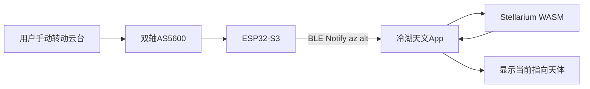

# 指星笔 / 寻星笔 — 阶段一 BOM（指星识别验证）

> 本文档描述**阶段一**硬件采购清单：仅验证「手动指向某方向 → App 识别最近天体」，不含电机自动寻星。精度目标 **1°**。  
> 关联背景见 [PROJECT_WEB_TO_APP_STATUS.md](./PROJECT_WEB_TO_APP_STATUS.md)；完整一体式方案见对话中的硬件总体规划。

---

## 一、阶段目标

| 项目 | 说明 |
|------|------|
| 验证内容 | 硬件持续上报当前光轴方向（Az/Alt），App 用 Stellarium 引擎反查「当前指向哪颗星」 |
| 不做 | 步进电机、驱动器、自动 GOTO、星敏相机、定制 PCB |
| 通信 | BLE（Bluetooth Low Energy），App 与 ESP32-S3 之间 GATT 读写/Notify |
| 精度 | 验收角距离误差 **≤ 1°**（经一星/两星校准后，对亮星/行星） |
| 样机预算 | 单套物料约 **¥300–650**（国内模块 + 3D 打印结构，不含人工与认证） |

**指星原理（阶段一）**：App 不能「看见激光打在星上」；硬件测量**激光光轴在水平坐标系下的方位角 Az、高度角 Alt**，App 根据观测地点、时间与星表，找角距离最近的天体并显示名称与置信度。

---

## 二、推荐形态

**无电机被动式两轴指星架**：

- 用户手动转动激光笔（或带离合的转台），编码器实时记录两轴角度。
- 固定在三脚架上，减少手持抖动。
- 激光默认关闭，App 或按键短时点亮；通信中断时固件关激光。

```text
        [ 激光模块 ]
             |
      [ 高度轴 + AS5600 ]
             |
      [ 方位轴 + AS5600 ]
             |
        [ 三脚架 1/4" ]
```

---

## 三、BOM 清单

### 3.1 主表

| 模块 | 器件 | 数量 | 作用 | 参考估价（¥） |
|------|------|-----:|------|-------------:|
| 主控 | ESP32-S3 开发板（带 USB、建议 8MB Flash） | 1 | BLE、I2C 读传感器、上报角度、激光安全逻辑 | 40–90 |
| 方位角 | AS5600 磁编码器模块 | 1 | 水平旋转角 Az | 10–25 |
| 高度角 | AS5600 磁编码器模块 | 1 | 俯仰角 Alt | 10–25 |
| I2C | TCA9548A I2C 多路复用模块 | 1 | 两个 AS5600 同地址（0x36），需分通道 | 8–20 |
| 姿态辅助 | MPU6050 / QMI8658 / ICM-42688 模块（任选其一） | 1 | 水平粗校、静止检测、辅助校准（非主测角） | 8–40 |
| 激光 | 520nm 或 532nm 绿光激光模块，**≤ 5mW** | 1 | 目视指向 | 20–80 |
| 激光驱动 | 恒流驱动板或自带驱动的激光模块 | 1 | 稳定光功率 | 10–30 |
| 开关 | N-MOS 小信号管或 MOSFET 模块 | 1 | 主控 GPIO 控制激光供电 | 3–10 |
| 安全 | 物理拨动开关 / 按键 / 急停（常闭优先） | 1–2 | 硬件默认可断激光 | 5–25 |
| 电池 | 18650 锂电池 | 1–2 | 供电（单节 1S 即可） | 15–50 |
| 充保 | TP4056 充电保护板，或带保护的 1S BMS | 1 | 充电与过充/过放保护 | 5–20 |
| 电源 | 5V / 3.3V 降压模块（AMS1117 或 DC-DC） | 1 | 逻辑与传感器 | 5–20 |
| 结构 | 3D 打印两轴支架（PLA/PETG） | 1 套 | 安装激光、编码器、轴承 | 50–150 |
| 机械件 | 小轴承、转轴、径向磁铁、M3 螺丝铜柱 | 1 套 | 两轴转动与 AS5600 磁环 | 30–80 |
| 线材 | 杜邦线、插座、热缩管 | 1 套 | 装配与调试 | 20–50 |
| 安装 | 1/4 英寸三脚架螺母或转接板 | 1 | 固定观测 | 5–20 |

**单套合计：约 ¥300–650**

### 3.2 推荐配置（1° 精度）

| 类别 | 推荐选型 | 说明 |
|------|----------|------|
| 主控 | ESP32-S3 开发板 | 原生 BLE，开发资料多 |
| 测角 | AS5600 ×2 + TCA9548A | 成本低，配合校准可达 ~1°；勿单靠 IMU/磁力计测方位 |
| 姿态 | MPU6050 或 QMI8658 | 仅辅助水平与静止判断，不必 BNO085 |
| 激光 | ≤5mW 绿光 + 物理开关 + MOSFET | 默认断电；低仰角软件禁开 |
| 结构 | 3D 打印 + 三脚架 | 编码器与光轴刚性对齐，后续做「光轴偏移」标定 |

### 3.3 阶段一暂不采购

| 器件 | 原因 |
|------|------|
| 步进电机、TMC2209 | 属阶段二自动寻星 |
| 减速箱、同步带、蜗杆 | 同上 |
| BNO085/BNO086（仅当预算极紧可省略；若已有可兼做水平参考） | 非必须；1° 以编码器为主 |
| AS5048A | 精度更好但阶段一非必须，可阶段二再升级 |
| 定制 PCB、注塑外壳 | 手板阶段用开发板 + 洞洞板/细线即可 |
| 星敏相机 | 阶段四高精度增强再考虑 |

---

## 四、预算汇总

| 档位 | 条件 | 单套（¥） |
|------|------|----------:|
| 省钱验证 | AS5600、便宜激光、简单打印件、单节电池 | 300–450 |
| 标准手板 | 上述推荐配置 + 稍好激光与结构 | 450–650 |
| 3–5 套联调 | 含备件、第二套编码器/电池、线材损耗 | 1500–3000（合计） |

以上为**物料费**，不含：人工装配、激光与电池合规检测、App BLE 插件开发、3D 打印外协加价。

---

## 五、工作原理与数据流



1. 观测前：App 设置地点、时间；完成水平 / 北向粗校、一星或两星校准。  
2. 指星时：用户对准目标，硬件以约 **10 Hz** 上报 `az`、`alt`（及电量、激光状态等）。  
3. App：在亮星、行星等候选集中计算角距离，最近且 **&lt; 1°**（可配置）则显示名称；否则提示「附近无明确目标」。  
4. 输出应含：**天体名、角距离、置信度**（与第二候选的间隔）。

### 5.1 与现有 App 的关系

| 能力 | 现有代码 | 阶段一新增 |
|------|----------|------------|
| 天体搜索/选中 | `target-search.vue`、`sw_helpers.querySkySources` | 可复用 |
| 目标 Az/Alt | `selected-object-info.vue` 中 `convertFrame(..., 'OBSERVED', ...)` | 指星反查需新增「方向 → 最近天体」 |
| BLE | 无 | Capacitor BLE 插件 + 设备页 + 校准向导 |

---

## 六、BLE 与固件要点（阶段一）

### 6.1 遥测示例（硬件 → App）

```json
{
  "type": "telemetry",
  "az": 47.12,
  "alt": 63.25,
  "battery": 0.82,
  "laser": false,
  "calibrated": true,
  "quality": 0.9
}
```

### 6.2 命令示例（App → 硬件）

| 命令 | 说明 |
|------|------|
| `hello` | 版本、能力、设备名 |
| `cal_point` | 校准：用户对准已知星后上报参考 |
| `cal_save` / `cal_clear` | 保存/清除校准参数 |
| `laser` | `{ "enabled": true, "durationMs": 3000 }`，超时自动关 |
| `stop` | 关激光 |

正式版可改为二进制帧；阶段一建议 **JSON + Notify** 便于串口与 BLE 同协议调试。

### 6.3 激光安全（必须）

- 硬件：**默认断电**，物理开关串联激光电源。  
- 固件：看门狗 / 断连 **&lt; 500 ms** 关激光。  
- 软件：低仰角（如 Alt &lt; 15°）禁止开启；默认点射 3–10 s。

---

## 七、校准与验收

### 7.1 建议校准流程

1. 三脚架调平（水平泡或 IMU 粗指示）。  
2. App 同步手机定位与时间（与 `App.vue` / `location-mgr` 一致）。  
3. **一星校准**：对准北极星或高亮星，点「已对准」。  
4. **两星校准**（推荐）：再对准相距较远的第二颗亮星，解算固定偏差。  
5. **光轴偏移**：激光轴与编码器数学轴的固定角差，写入 NVS。

### 7.2 验收指标（1°）

| 项目 | 指标 |
|------|------|
| 指星识别 | 对 3 颗以上亮星，显示名称与真实指向角距离 **≤ 1°** |
| 遥测延迟 | 手动转动后 App 显示更新 **&lt; 300 ms** |
| 上报频率 | ≥ 10 Hz（手动模式） |
| BLE 距离 | 空旷环境稳定连接 **≥ 10 m** |
| 激光安全 | 断连、急停、超时均能关闭激光 |

---

## 八、采购与装配注意

| 主题 | 说明 |
|------|------|
| AS5600 | 每轴转轴上需配 **径向充磁磁铁**（直径与模块说明一致）；磁铁离电机/扬声器远 |
| TCA9548A | 两路 AS5600 接不同通道，I2C 上拉 4.7k 一般开发板已带 |
| 磁力计 | 阶段一**不依赖**磁力计测方位；若后续加 MMC5983，远离电池与金属三脚架 |
| 激光 | 采购时确认功率等级与光斑；户外使用需遵守当地激光法规 |
| 打印件 | 激光与高度轴 **共轴或固定偏移**，偏移量写入校准参数 |

---

## 九、阶段二预告（不在本 BOM 内）

阶段二在相同 App 协议上增加：**NEMA 8/11 步进电机 ×2、TMC2209 ×2、闭环寻星 GOTO**，详见后续 `STAR_POINTER_PHASE2_BOM.md`（待编写）。

---

## 十、变更记录

| 日期 | 摘要 |
|------|------|
| 2026-05-18 | 初版：阶段一指星识别 BOM、预算、原理、BLE 与安全、1° 验收 |

---

*BOM 价格随采购渠道波动，表中估价为 2026 年国内模组/开发板常见区间，仅供手板预算参考。*
